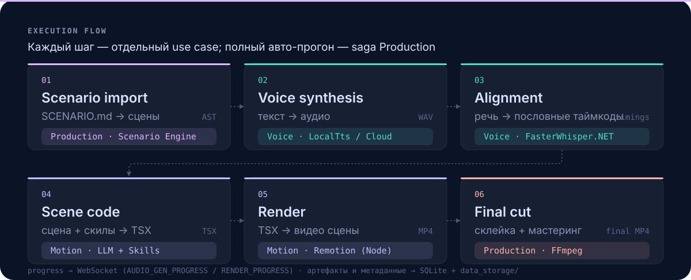
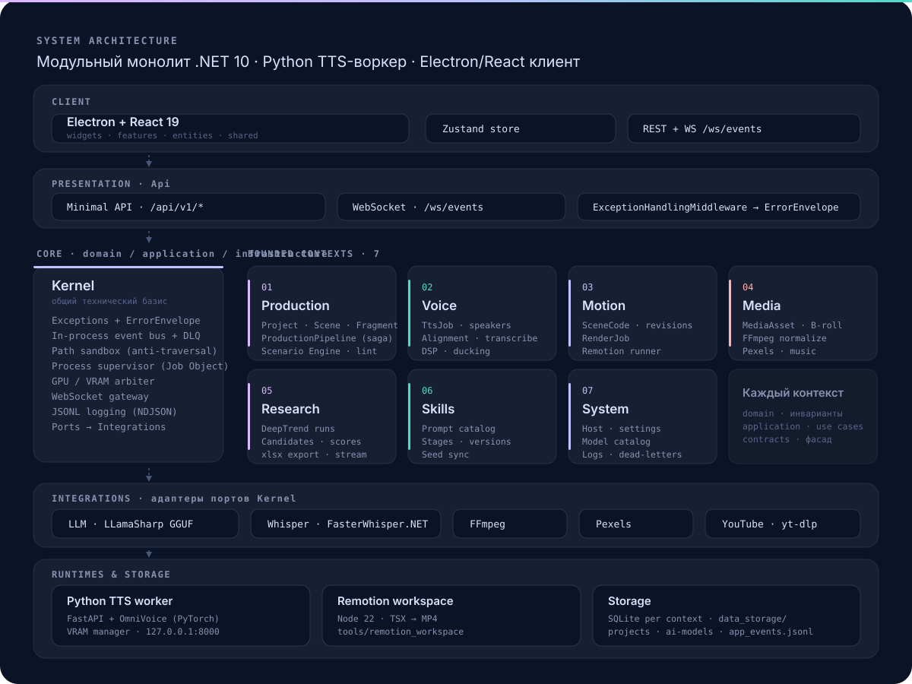

<p align="center">
  
</p>

<p align="center">
  <a href="#архитектура"></a>
  <a href="#python-tts-воркер"></a>
  <a href="#фронтенд-electron--react"></a>
  <a href="#фронтенд-electron--react"></a>
  <a href="#архитектура"></a>
  <a href="#архитектура"></a>
  <br>
  <a href="./docs/SCENARIO_RULES.md"></a>
  <a href="./backend2/docs/ARCHITECTURE.md"></a>
  <a href="./docs/YOUTUBE_SEARCH.md"></a>
</p>

**Vidora** — локальная студия, которая превращает Markdown-сценарий (`SCENARIO.md`) в готовое **MP4**: синтез речи, пословная синхронизация, генерация анимации Remotion и мастеринг. Каждую AI-задачу можно выполнять **локально на GPU** или **в облаке** — выбор делается на уровне отдельного движка.

<p align="center">
  
</p>

## Что это

Vidora — это **программируемый конвейер видео**, а не генератор «из промпта в видео». Вы пишете сценарий в Markdown, а Vidora исполняет его как пайплайн:

- **Сценарий — единственный источник правды.** `SCENARIO.md` парсится в сцены и фрагменты; всё, что не описано, в видео не попадёт.
- **Звук — отдельный движок.** Локальный TTS-воркер на GPU (`python_services/tts_engine`) или облачные провайдеры.
- **Анимация — код.** LLM генерирует Remotion TSX, который затем детерминированно рендерится в кадры. Любую ревизию можно откатить.
- **Контроль на каждом шаге.** Можно запускать стадии по отдельности или весь проект целиком одной сагой.

## Возможности

- **Markdown → MP4** — `SCENARIO.md` с YAML-шапкой становится готовым видео.
- **Гибридная озвучка** — локальный воркер (OmniVoice на PyTorch) или облако (MiniMax, OpenAI); переключение по движку.
- **Клонирование и Voice Design** — профили спикеров, клонирование по референсу, превью голоса, дизайн-промпты.
- **Пословная синхронизация** — нативный `FasterWhisper.NET` (CTranslate2, word timestamps) с fallback-таймингами.
- **Аудио-постобработка** — DSP-фильтры, удаление тишины, дакинг музыки под голос, склейка дорожек, транскрипция.
- **AI-анимация** — Remotion TSX генерирует локальный LLM (LLamaSharp + GGUF) со «скилами» стадии; история ревизий и откаты.
- **Сценарный движок** — parse + lint + двусторонняя синхронизация Markdown ↔ AST + ИИ-копилот для переписывания реплик.
- **Полный авто-прогон** — сага Production: озвучка → тайминги → код сцены → рендер → финальная сборка и экспорт.
- **Медиатека** — загрузка файлов, нормализация B-roll через FFmpeg, стоки Pexels, музыкальная библиотека.
- **Исследование идей (DeepTrend)** — поиск YouTube-трендов, ранние сигналы, анализ хуков и конкурентов, поток NDJSON, экспорт `.xlsx`.
- **Скилы** — каталог промпт-пакетов по стадиям, версии, синхронизация с seed-набором.
- **Надёжная платформа** — in-process шина событий с Dead-Letter очередью, песочница путей, супервизор процессов (Windows Job Objects), арбитр VRAM, WebSocket-прогресс, NDJSON-логи.

## Как это работает

| # | Стадия | Отвечает | Результат |
|---|--------|----------|-----------|
| 1 | Импорт сценария | Production · Scenario Engine | AST сцен + список проблем + длительность |
| 2 | Синтез речи | Voice · LocalTts / MiniMax / OpenAI | WAV по тексту фрагментов |
| 3 | Синхронизация | Voice · FasterWhisper.NET | Пословные таймкоды и тайминги фрагментов |
| 4 | Генерация сцены | Motion · LLM + Skills | Remotion TSX + ревизии |
| 5 | Рендер | Motion · Remotion (Node 22) | Видеофрагмент сцены (MP4) |
| 6 | Финальная сборка | Production · FFmpeg | Итоговое видео проекта + экспорт |

Каждый шаг — отдельный use case и доступен по своему эндпоинту. Полный авто-прогон проекта — это **сага** `Production`, которая вызывает остальные контексты и реагирует на их события.

## Архитектура

Три независимых процесса, связанные по HTTP и WebSocket:

<p align="center">
  
</p>

| Процесс | Технология | Порт | Роль |
|---------|-----------|------|------|
| `backend2/` | ASP.NET Core, .NET 10 | `5116` | Оркестратор: REST API, WebSocket, доменная логика |
| `python_services/tts_engine/` | FastAPI + PyTorch | `8000` | Локальный ML-воркер: синтез и клонирование голоса |
| `frontend/` | Electron + Vite | `5173` (dev) | Десктоп-редактор: React-рендерер |

### Бэкенд: модульный монолит (.NET 10)

`backend2` — это **модульный монолит по принципам DDD**, а не набор микросервисов: один процесс, одна файловая система, SQLite на каждый контекст. Каждый bounded context построен по Clean Architecture / Ports & Adapters, зависимости направлены строго внутрь.

```text
Api            Minimal API эндпоинты по контекстам + WebSocket + middleware (только DTO и вызов use case)
  │
Bounded Contexts   Production · Voice · Motion · Media · Research · Skills · System
  │                     domain (инварианты, порты, события) ← application (use cases) ← infrastructure (адаптеры)
  │
Kernel         общие контракты, порты и платформа (никого из приложения не импортирует)
  ▲
Integrations   адаптеры портов: LLM, FFmpeg, Pexels, YouTube, Whisper
```

Правила модульности:

- `domain` ничего не знает об `application`, инфраструктуре, API и фреймворках.
- `application` знает только `domain` и публичные контракты других контекстов.
- Чужие bounded context'ы импортируются **только через фасад `contracts`**; ссылки на чужие агрегаты — только по ID.
- Межконтекстная коммуникация — через in-process шину доменных событий, без общих мутабельных синглтонов.

#### Ядро (`Kernel`)

| Модуль | Что даёт |
|--------|----------|
| Exceptions | Типизированные ошибки + единый конверт `ErrorEnvelope`, маппинг на HTTP-коды |
| Events | In-process шина (`System.Threading.Channels`) + Dead-Letter очередь для упавших обработчиков |
| FileSystem | Песочница путей (`allowed_roots`), защита от Path Traversal и symlink/junction |
| Process | Супервизор CLI с Windows Job Objects — дочерние процессы не остаются сиротами |
| Gpu | Двухуровневый лок VRAM (семафор + файл-лок) против OOM между воркерами и Chromium |
| WebSockets | Шлюз рассылки прогресса `{event, data, timestamp}` всем клиентам |
| Logging | Структурированные NDJSON-логи в `data_storage/app_events.jsonl` |
| Ports | Абстракции `ILlmClient`, `IFfmpegClient`, `IRemotionRunner` |

#### Bounded contexts

| Контекст | Ответственность | Ключевые данные |
|----------|-----------------|-----------------|
| **Production** | Сценарий, сцены и фрагменты, тайминги, сага производства, финальная сборка и экспорт | `production.db`, `projects/` |
| **Voice** | TTS-задачи и батчи, спикеры, выравнивание, транскрипция, DSP и дакинг | `voice.db`, WAV-ассеты |
| **Motion** | Код сцены и ревизии, задачи рендера, запуск Remotion | `motion.db`, `code_history/` |
| **Media** | Ассеты, нормализация B-roll, стоки Pexels, музыкальная библиотека | `media.db`, `uploads/` |
| **Research** | DeepTrend-прогоны, кандидаты, сигналы, возможности, экспорт идей | `research.db` |
| **Skills** | Каталог промпт-пакетов по стадиям, версии, seed-синхронизация | `skills.db` |
| **System** | Статус хоста, настройки, каталог и скачивание моделей, логи, dead-letters | `system.db` |

#### События, хранилище и тесты

- **Доменные события** доставляются асинхронно фоновым диспетчером; сбой обработчика логируется и уходит в Dead-Letter очередь (`GET /api/v1/system/dead-letters`), не роняя шину.
- **Хранилище** — SQLite-файл на каждый контекст плюс `data_storage/` (проекты, модели, временные файлы). Миграции применяются через `dotnet run -- --migrate` (CLI-флаг в `Program.cs`).
- **Тесты** — xUnit в `backend2/tests/Kernel.Tests` (песочница путей, GPU-лок, шина событий, супервизор процессов, middleware, интеграция YouTube, Whisper). Плюс `ddd_guard.py` — архитектурный линтер DDD-правил.

### Python TTS-воркер

Отдельный **stateless** микросервис (`python_services/tts_engine`) для тяжёлых задач на GPU. C# передаёт абсолютные пути к файлам, воркер читает/пишет на диск и не хранит состояние между запросами (кроме одной загруженной модели в VRAM).

- **Движок:** OmniVoice (`k2-fsa/OmniVoice`) на PyTorch; режимы fp16 / int8 / fp32.
- **Адаптеры:** реестр движков с ленивой загрузкой; C# получает список через `GET /api/v1/models`.
- **VRAM-менеджер:** держит в памяти ровно один движок, вытесняет предыдущий, чистит кэш CUDA.
- **HTTP API:** `/api/v1/models`, `/api/v1/synthesize`, `/api/v1/clone`, `/api/v1/vram/unload`, `/health`.

> Транскрипция и выравнивание живут **не в Python**, а в C# (`FasterWhisper.NET`). Воркер не скачивает Whisper: `reference_text` для клонирования обязан передать бэкенд. Подробности — в [`python_services/tts_engine/README.md`](./python_services/tts_engine/README.md).

### Фронтенд: Electron + React

Десктоп-клиент построен по **Feature-Sliced Design**: строгие слои с однонаправленными зависимостями (сверху вниз).

| Слой | Назначение | Примеры |
|------|-----------|---------|
| `app` | Точка входа, глобальные стили и провайдеры | `index.tsx`, `styles/globals.css` |
| `pages` | Компоновка страницы | `MainPage` |
| `widgets` | Крупные самодостаточные блоки UI | `editor-workspace`, `scenario-builder`, `dashboard`, `audio-hub`, `global-settings` |
| `features` | Действия пользователя | `inspect-video`, `analyze-hook`, `apply-hook`, `skills-editor`, `research-export`, `settings` |
| `entities` | Доменные сущности и их модели | `project`, `skills`, `video-candidate` |
| `shared` | Переиспользуемая база без бизнес-логики | `api`, `ui`, `lib`, `config` |

- **Стек:** React 19, TypeScript 6, Vite 8, Tailwind CSS 4, Zustand 5 (`lucide-react` для иконок).
- **Состояние:** лёгкие Zustand-сторы (`useEditorWorkspace`, `useSettingsStore`, `useScenarioEngineStore`).
- **Связь с бэкендом:** REST + WebSocket. Базовый адрес — `VITE_API_URL` (по умолчанию `http://localhost:5116`).
- **Стиль:** тёмная тема «Lumina Cinematic» с пресетами (Dracula, GitHub Dark, Tailwind Ocean…) — те же токены палитры используются в анимациях Remotion.
- **Качество:** ESLint и `steiger` для проверки границ FSD (`pnpm lint:fsd`).

### Потоки данных

1. **Синхронизация сценария.** Редактор отправляет Markdown в `POST /api/v1/production/engine/{projectId}/sync` → Scenario Engine парсит и линтит → возвращает отформатированный Markdown, AST, список проблем и длительность.
2. **Озвучка.** `POST /api/v1/voice/synthesize` (или `/batch`) → `VoiceModule` выбирает провайдер → локальный `LocalTtsClient` дергает Python-воркер или облачный движок → WAV сохраняется на диск.
3. **Код и рендер.** `POST /api/v1/motion/scenes/generate` просит LLM сгенерировать Remotion TSX (со скилами стадии) → `POST /api/v1/motion/scenes/{id}/render` запускает Remotion в `tools/remotion_workspace` → прогресс уходит по WebSocket.
4. **Полная сборка.** `POST /api/v1/production/projects/{id}/build` запускает сагу: озвучка → тайминги → код → рендер сцен → склейка и мастеринг → экспорт.
5. **Исследование.** `POST /api/v1/research/start` + поток `GET /api/v1/research/runs/{id}/stream` (NDJSON) отдают идеи по мере готовности.

### API (основное)

Все эндпоинты под префиксом **`/api/v1`**; аутентификации нет — сервис рассчитан на локальный хост.

| Группа | База | Назначение |
|--------|------|-----------|
| Production | `/production` | Проекты, сценарий, сборка, экспорт |
| Scenario Engine | `/production/engine` | `sync`, `lint`, `lint-draft`, `copilot/rewrite` |
| Voice | `/voice` | `engines`, `synthesize`, `batch`, `align`, `transcribe`, `process-dsp`, `concat`, `ducking`, `speakers/profiles`, `vram/unload` |
| Motion | `/motion` | `capabilities`, `scenes/generate`, ревизии и откат, `scenes/{id}/render`, `renders/{jobId}` |
| Media | `/media` | `upload`, `normalize`, `stock/search`, `stock/import`, `process-broll`, `music/catalog`, `stream` |
| Research | `/research` | `start`, `runs`, `opportunities`, `export/excel`, `stream` |
| YouTube Agent | `/youtube` | `agent/stream`, `agent/analyze-hook`, `agent/draft-script`, `agent/suggest-competitors`, `agent/analyze-channel`, `more-videos`, `download-meta` |
| Skills | `/skills` | CRUD + `bundle/{stage}` + `reset` |
| System | `/system` | `status`, `settings`, `models`, `models/catalog`, `models/{id}/download`, `logs`, `dead-letters` |

**WebSocket:** `ws://localhost:5116/ws/events/{clientId}` — конверт `{ "event": "...", "data": { ... }, "timestamp": "..." }`. Типовые события — `AUDIO_GEN_PROGRESS`, `RENDER_PROGRESS`.

## Скилы (навыки ИИ)

**Скилы** — это переиспользуемые промпт-пакеты, привязанные к стадии конвейера. Они хранятся в SQLite (`skills.db`), подмешиваются в системный промпт при генерации и правятся без перезапуска сервиса.

### Стадии

| Стадия (`stage`) | Где применяется |
|------------------|-----------------|
| `scene_generation` | Генерация Remotion TSX для сцены |
| `hook_analysis` | Анализ вступления/хука видео |
| `script_drafting` | Черновик сценария (YouTube-агент) |
| `visual_analysis` | Визуальный разбор и подбор |
| `trend_research` | Темы и тренды DeepTrend |
| `broll_matching` | Подбор B-Roll по визуальным ремаркам |

### Как собирается промпт

`SkillsCatalog.GetSkillBundleForStageAsync(stage, maxTokenLimit, customHeader)` берёт **только включённые** скилы стадии, `PromptBuilder` сортирует их по `priority`, склеивает `content` и укладывает в лимит токенов. На выходе — `SkillBundleDto`: `system_prompt`, `included_skills`, `omitted_skills`, `total_estimated_tokens`. Именно этот бандл получает LLM на стадии (см. ответ `/api/v1/code/generate` → `applied_stage`, `included_skills`).

### Поля скила

`id`, `name`, `description`, `stage`, `content`, `priority`, `version`, `is_default`, `is_enabled`, `tags`, `estimated_tokens`, `updated_at`.

### API

| Метод | Путь | Назначение |
|-------|------|-----------|
| `GET` | `/api/v1/skills` | Список скилов (`?stage=`, `?only_enabled=true`) |
| `GET` | `/api/v1/skills/bundle/{stage}` | Скомпонованный бандл (`?max_tokens=`, `?custom_header=`) |
| `GET` | `/api/v1/skills/{id}` | Один скил |
| `POST` | `/api/v1/skills` | Создать пользовательский скил |
| `PUT` / `PATCH` | `/api/v1/skills/{id}` | Обновить (включая `is_enabled`) |
| `POST` | `/api/v1/skills/{id}/reset` | Вернуть дефолтный скил к системному шаблону |
| `DELETE` | `/api/v1/skills/{id}` | Удалить пользовательский скил |

Каждый эндпоинт задокументирован в Swagger UI (`/swagger`) — краткая суть, описание, входные и выходные данные.

### Seed и синхронизация

- Источник дефолтного набора — `backend2/src/Skills/Infrastructure/Seeding/skills_seed.json`.
- На старте `SkillsSeederHostedService` делает **upsert** дефолтных скилов и **деактивирует** те, что пропали из seed; пользовательские скилы не трогаются. `reset` восстанавливает системный шаблон конкретного скила.
- UI: **Глобальные настройки → «Скиллы (Навыки ИИ)»** (`SkillsSettingsView`, стор `useSkillsStore`).

Спецификация контекста — [`backend2/docs/SKILLS_SPEC.md`](./backend2/docs/SKILLS_SPEC.md).

## Начало работы

### Требования

- **.NET SDK 10**
- **Node.js 20+** и **pnpm**
- **Python 3.11+** — для локального TTS-воркера
- **NVIDIA + CUDA** — для инференса на GPU (опционально)
- **FFmpeg** — в `backend2/tools` или в `PATH`; **yt-dlp** идёт в комплекте (`backend2/tools/yt-dlp.exe`)

### Установка

```bash
git clone https://github.com/NIKIRIKI7/Vidora.git
cd Vidora

# 1. Фронтенд
cd frontend
pnpm install

# 2. Бэкенд (.NET)
cd ../backend2
dotnet restore

# 3. Миграции SQLite
cd ../frontend
pnpm backend:migrate
```

Локальный TTS-воркер (опционально, если нужна озвучка на GPU):

```bash
cd python_services/tts_engine
python -m venv venv
venv\Scripts\pip install -r requirements.txt

# CUDA-колёса PyTorch (см. README воркера — версии torch/torchaudio должны совпадать)
# ...

# Веса OmniVoice
python -c "from huggingface_hub import snapshot_download; snapshot_download('k2-fsa/OmniVoice', local_dir='ai-models/OmniVoice')"
```

### Запуск

```bash
cd frontend

# Всё сразу: backend2 (:5116) + Vite (:5173)
pnpm dev:all

# По отдельности
pnpm backend:dev     # dotnet run backend2 (профиль http)
pnpm dev             # Vite на :5173
pnpm electron:dev    # окно Electron

# Python TTS-воркер — в отдельном терминале
cd ../python_services/tts_engine && python main.py   # :8000
```

Открой **http://localhost:5173**, создай проект и вставь `SCENARIO.md` — пример и правила формата в [`docs/SCENARIO_RULES.md`](./docs/SCENARIO_RULES.md).

## Настройка моделей

Конфигурация бэкенда — `backend2/appsettings.json`; часть параметров переопределяется через системные настройки (`/api/v1/system/settings`).

| Что | Где | Примечание |
|-----|-----|-----------|
| **Whisper (STT/выравнивание)** | `data_storage/ai-models/whisper/faster-whisper-small` | `Integrations:Whisper`; при отсутствии скачивается автоматически |
| **Локальный LLM** | `data_storage/ai-models/gemma3-4b/gemma-3-4b-it-Q4_K_M.gguf` | `Integrations:LLM:ModelPath`, `GpuLayers` (0 = CPU) |
| **Локальный TTS** | `python_services/tts_engine/ai-models/OmniVoice` | Один движок в VRAM за раз |
| **Облачный TTS: OpenAI** | системная настройка `integrations.openai.api_key` | Движок появляется при заданном ключе |
| **Облачный TTS: MiniMax** | `integrations.minimax.api_key` + `integrations.minimax.group_id` | — |
| **Pexels (стоки)** | `Integrations:Pexels:ApiKey` | Без ключа поиск стоков пропускается |
| **YouTube** | `Integrations:YouTube` + `tools/yt-dlp.exe` | InnerTube + yt-dlp |
| **Remotion** | `tools/remotion_workspace`, `tools/node22` | Node 22 идёт в комплекте; бэкенд `motion.gl_backend`, `motion.concurrency` |

## Структура проекта

```text
Vidora/
├── backend2/                      # .NET 10 — модульный монолит (DDD)
│   ├── Program.cs                 # композиционный корень: DI + Minimal API
│   ├── appsettings.json           # хранилище, интеграции, YouTube, Motion
│   ├── src/
│   │   ├── Api/                   # эндпоинты по контекстам + WebSockets + middleware
│   │   ├── Kernel/                # события, исключения, песочница, процессы, GPU, WS, логи
│   │   ├── Integrations/          # адаптеры портов: LLM, FFmpeg, Pexels, YouTube, Whisper
│   │   ├── Production/            # BC: проект, сцены, фрагменты, сага, Scenario Engine
│   │   ├── Voice/                 # BC: TTS, спикеры, выравнивание, DSP, дакинг
│   │   ├── Motion/                # BC: код сцены, ревизии, рендер Remotion
│   │   ├── Media/                 # BC: ассеты, B-roll, стоки, музыка
│   │   ├── Research/              # BC: DeepTrend — идеи, кандидаты, аналитика
│   │   ├── Skills/                # BC: каталог промптов по стадиям
│   │   └── System/                # хост, настройки, каталог моделей, логи
│   ├── tests/Kernel.Tests/        # xUnit: ядро и интеграции
│   ├── tools/                     # node22, cuda12, remotion_workspace, yt-dlp
│   └── data_storage/              # SQLite per context, projects, ai-models, NDJSON-лог
├── python_services/tts_engine/    # FastAPI + OmniVoice (GPU), независимый venv
├── frontend/                      # Electron + React 19 (FSD) + Vite
│   └── src/                       # app, pages, widgets, features, entities, shared
├── assets/readme/                 # SVG-визуализации README
└── docs/                          # SCENARIO_RULES, YOUTUBE_SEARCH, design
```

## Стек

| Слой | Технологии |
|------|------------|
| **Бэкенд** | .NET 10, ASP.NET Core Minimal API, EF Core + SQLite, `FasterWhisper.NET.Gpu`, `LLamaSharp` (GGUF) |
| **TTS-воркер** | Python 3.11+, FastAPI, Uvicorn, OmniVoice (PyTorch), soundfile |
| **Фронтенд** | React 19, TypeScript 6, Vite 8, Tailwind CSS 4, Zustand 5 |
| **Десктоп** | Electron 43, electron-builder |
| **Медиа** | Remotion (Node 22), FFmpeg |
| **Исследование** | yt-dlp, InnerTube, экспорт `.xlsx` |
| **Архитектура** | DDD / Clean Architecture, Feature-Sliced Design |
| **Инструменты** | xUnit, `ddd_guard.py`, ESLint, Steiger |

## Скрипты

Запускаются из `frontend/`:

| Команда | Описание |
|---------|----------|
| `pnpm dev` | Vite dev-сервер (:5173) |
| `pnpm build` | TypeScript + Vite production-сборка |
| `pnpm lint` | ESLint |
| `pnpm lint:fsd` | Steiger — проверка границ FSD |
| `pnpm electron:dev` | Electron в dev-режиме |
| `pnpm electron:build` | Сборка десктоп-приложения |
| `pnpm backend:dev` | Бэкенд `backend2` через `dotnet run` (:5116) |
| `pnpm backend:migrate` | Применение миграций SQLite |
| `pnpm dev:all` | Бэкенд + фронтенд одновременно |

## Сравнение с аналогами

| Продукт | Подход | Vidora |
|---------|--------|--------|
| **Runway / Pika** | Текст → видео через diffusion | Точный сценарий, свой голос, монтируемая анимация |
| **Synthesia / HeyGen** | Аватар + TTS | Без аватаров, open-code-подход, Remotion |
| **Descript** | Мультитрек + AI | Программируемый пайплайн, кодовая гибкость |
| **Invideo AI** | Текст → шаблоны | Свой TTS, своя анимация, прозрачный конвейер |
| **Manim** | Python-анимации | TTS + анимация + мастеринг в одном флоу |

Vidora — **программируемая альтернатива**: Markdown → TTS + Remotion + FFmpeg под вашим контролем. Гибрид «облако для тяжёлого, локально для звука» экономит на API.

## Ограничения

- **Windows-first платформа.** Супервизор процессов опирается на Windows Job Objects, нативные библиотеки Whisper/CUDA — под win-x64; Linux/macOS поддерживаются частично.
- **Нет аутентификации и `CORS: AllowAll`.** Рассчитано на локальный запуск — не выставляйте порты `5116`/`8000` в публичную сеть.
- **Рендер Remotion требует Node 22 и headless Chromium** в рабочей области `backend2/tools/remotion_workspace`.
- **Локальный LLM** ограничен выбранной GGUF-моделью и VRAM; при `GpuLayers = 0` инференс идёт на CPU.
- **SQLite на каждый контекст.** Миграции — через `pnpm backend:migrate`; одновременная запись из нескольких процессов не предполагается.
- **Лицензия:** в репозитории нет файла `LICENSE`.

## Документация

- [`docs/SCENARIO_RULES.md`](./docs/SCENARIO_RULES.md) — полный формат `SCENARIO.md`
- [`docs/SCENARIO.example.md`](./docs/SCENARIO.example.md) — пример сценария
- [`backend2/docs/ARCHITECTURE.md`](./backend2/docs/ARCHITECTURE.md) — структура и план .NET-бэкенда
- [`backend2/docs/KERNEL_SPEC.md`](./backend2/docs/KERNEL_SPEC.md) — спецификация `Kernel`
- [`backend2/docs/SKILLS_SPEC.md`](./backend2/docs/SKILLS_SPEC.md) — контекст скилов
- [`python_services/tts_engine/README.md`](./python_services/tts_engine/README.md) — TTS-воркер
- [`docs/YOUTUBE_SEARCH.md`](./docs/YOUTUBE_SEARCH.md) — исследование YouTube-ниш

---

**Версия:** v0.1.0
