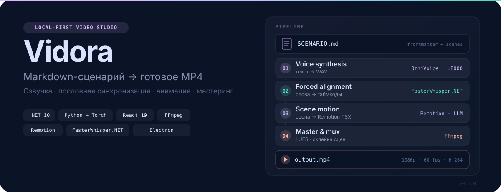
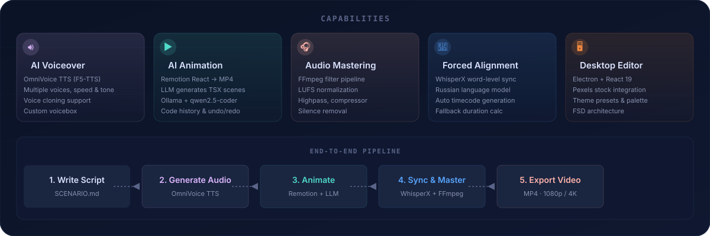

<p align="center">
  <picture>
    <source media="(prefers-color-scheme: dark)" srcset="./assets/readme/hero.svg">
    
  </picture>
</p>

<p align="center">
  <a href="#возможности"></a>
  <a href="#возможности"></a>
  <a href="#возможности"></a>
  <a href="#возможности"></a>
  <br>
  <a href="./LICENSE"></a>
  <a href="./docs/SCENARIO_RULES.md"></a>
  <a href="./docs/YOUTUBE_SEARCH.md"></a>
</p>

**Vidora** превращает Markdown-сценарий в готовое MP4: синтез речи, Remotion-анимация, аудиомастеринг и десктоп-редактор. Каждая AI-задача — сценарий, кодогенерация, озвучка — настраивается отдельно: **в облаке или локально на GPU**.

<p align="center">
  
</p>

## Возможности

- **Markdown → MP4** — сценарий в `SCENARIO.md` с YAML-шапкой становится готовым видео.
- **AI-озвучка** — локально OmniVoice, Qwen3-TTS 1.7B (Voice Design, клонирование), MOSS-TTS 1.7B; в облаке MiniMax/OpenAI.
- **Гибридная маршрутизация** — сценарий, визуал и озвучка переключаются облако/локально по отдельности.
- **AI-анимация** — Remotion TSX генерирует Claude/DeepSeek (облако через RouterAI/AITunnel) или локальный GGUF (llama.cpp).
- **Аудиомастеринг** — FFmpeg: LUFS, компрессор, noise gate от артефактов LLM-TTS, удаление тишины.
- **Форсированное выравнивание** — WhisperX word-level синхронизация с русской моделью.
- **Десктоп-редактор** — Electron + React 19, три панели, тёмная тема, Feature-Sliced Design.
- **Undo/Redo** — 50 шагов истории изменений.
- **Сток-библиотека** — Pexels, drag-n-drop B-roll.
- **Тематические пресеты** — Dracula, Vercel, GitHub Dark, Tailwind Ocean.

## Как это работает

| Стадия | Инструмент | Результат |
|--------|-----------|-----------|
| 1. Озвучка | OmniVoice / Qwen3-TTS / MOSS-TTS (локально) или MiniMax (облако) | WAV с голосом по тексту сценария |
| 2. Выравнивание | WhisperX forced alignment | Слова, привязанные к таймкодам |
| 3. Анимация | Claude/DeepSeek (облако) или GGUF через llama.cpp (локально) | Remotion TSX-сцена под текст |
| 4. Сборка | Remotion + FFmpeg | MP4: анимация + озвучка + мастеринг |

Каждый этап запускается отдельно — или одной кнопкой, полным авто-пайплайном.

## Начало работы

### Быстрый старт (dev)

```bash
git clone https://github.com/NIKIRIKI7/Vidora.git
cd Vidora

# Windows:
powershell -ExecutionPolicy Bypass -File setup.ps1
# macOS / Linux:
# chmod +x setup.sh && ./setup.sh

# Запуск всего сразу:
cd frontend && pnpm dev:all
```

Открой **http://localhost:5173**. Бэкенд — на порту 8355.

### Пошаговая установка

#### 1. Бэкенд (Python 3.11+)

```bash
cd backend
python -m venv .venv
# Windows:
.venv\Scripts\pip install -r requirements.txt
# macOS / Linux:
# source .venv/bin/activate && pip install -r requirements.txt
```

#### 2. Фронтенд (Node.js 20+)

```bash
cd frontend
pnpm install
```

#### 3. Remotion (отдельный Node.js проект)

```bash
cd backend/remotion-project
npm install
```

### Запуск

```bash
cd frontend

# A. Всё сразу (Vite + бэкенд):
pnpm dev:all

# B. По отдельности:
pnpm dev              # Vite на 5173
pnpm backend:dev      # FastAPI на 8355
pnpm electron:dev     # Electron окно

# C. Electron production:
pnpm backend:build    # PyInstaller → backend.exe
pnpm electron:build   # electron-packager → frontend/release/
```

## Настройка AI-моделей

Локальные модели лежат в `backend/ai-models/`. Каждый LLM-TTS движок работает в **своём venv**, потому что их зависимости несовместимы: OmniVoice требует `transformers 5.x`, Qwen3-TTS — `4.x`, MOSS-TTS — ровно `5.0`.

### OmniVoice (TTS, основной движок)

```bash
cd backend
python -c "from huggingface_hub import snapshot_download; snapshot_download('k2-fsa/OmniVoice', local_dir='ai-models/OmniVoice')"
```

### Qwen3-TTS 1.7B (Voice Design / клонирование / спикеры)

```bash
cd backend
python -m venv .venv-qwen
.venv-qwen\Scripts\pip install torch --index-url https://download.pytorch.org/whl/cu124
.venv-qwen\Scripts\pip install qwen-tts soundfile
```

```bash
python -c "from huggingface_hub import snapshot_download; [snapshot_download(m, local_dir=d) for m,d in [('Qwen/Qwen3-TTS-12Hz-1.7B-VoiceDesign','ai-models/Qwen3-TTS-VoiceDesign'),('Qwen/Qwen3-TTS-12Hz-1.7B-Base','ai-models/Qwen3-TTS-Base'),('Qwen/Qwen3-TTS-12Hz-1.7B-CustomVoice','ai-models/Qwen3-TTS-CustomVoice')]]"
```

### MOSS-TTS 1.7B

```bash
cd backend
python -m venv .venv-moss
.venv-moss\Scripts\pip install torch torchaudio --index-url https://download.pytorch.org/whl/cu124
.venv-moss\Scripts\pip install "transformers==5.0.0" soundfile
```

```bash
python -c "from huggingface_hub import snapshot_download; [snapshot_download(m, local_dir=d) for m,d in [('OpenMOSS-Team/MOSS-TTS-Local-Transformer','ai-models/MOSS-TTS-Local-Transformer'),('OpenMOSS-Team/MOSS-Audio-Tokenizer','ai-models/MOSS-Audio-Tokenizer')]]"
```

Бэкенд вызывает нужный venv через subprocess (`app/services/tts_worker.py`) — основной процесс остаётся чистым.

### WhisperX (forced alignment)

Модели качаются автоматически при первом `/api/v1/audio/sync`:

- `Systran/faster-whisper-base` — транскрипция.
- `jonatasgrosman/wav2vec2-large-xlsr-53-russian` — русский язык.

## Сравнение с аналогами

| Продукт | Подход | Vidora |
|---------|--------|--------|
| **Runway Gen-3 / Pika** | Текст → видео через diffusion | Точный сценарий, свой голос, монтаж |
| **Synthesia / HeyGen** | Аватар + TTS | Без аватаров, open-source, Remotion |
| **Descript** | Мультитрек + AI | Программируемый пайплайн, кодовая гибкость |
| **Invideo AI** | Текст → шаблоны | Свой TTS, своя анимация, прозрачность |
| **Manim (3B1B)** | Python-анимации | TTS + анимация + мастеринг в одном флоу |

Vidora — **программируемая альтернатива**: Markdown → TTS + Remotion + FFmpeg под твоим контролем. Гибрид «облако для тяжёлого, локально для звука» экономит на API.

## Структура проекта

```
Vidora/
├── backend/                        # Python FastAPI
│   ├── app/
│   │   ├── api/                    # audio, code, render, media, youtube, system
│   │   ├── services/               # audio_provider, tts_worker, yt_agent, llama_local
│   │   └── main.py
│   ├── ai-models/                  # OmniVoice, Qwen3-TTS, MOSS-TTS, WhisperX
│   └── remotion-project/           # Remotion-сборка React компонентов
├── frontend/                       # Electron + React
│   ├── electron/                   # main.cjs, preload.cjs, build.cjs
│   └── src/                        # FSD: entities, features, widgets, shared
├── assets/readme/                  # README SVG-визуализации
└── docs/                           # SCENARIO_RULES, YOUTUBE_SEARCH
```

## Стек

| Слой | Технологии |
|------|------------|
| **Фронтенд** | React 19, TypeScript 6, Vite 8, Tailwind CSS 4, Zustand 5 |
| **Десктоп** | Electron 43, electron-builder, electron-packager |
| **Бэкенд** | Python 3.11+, FastAPI, WebSockets, uvicorn |
| **AI/ML** | OmniVoice (F5-TTS), Qwen3-TTS 1.7B, MOSS-TTS 1.7B, WhisperX, llama.cpp, PyTorch |
| **Медиа** | FFmpeg, Remotion (React → MP4) |
| **Архитектура** | Feature-Sliced Design (FSD) |

## Скрипты

| Команда | Описание |
|---------|----------|
| `pnpm dev` | Vite dev-сервер |
| `pnpm build` | TypeScript + Vite build |
| `pnpm electron:dev` | Electron в dev-режиме |
| `pnpm electron:build` | Сборка десктоп установщика |
| `pnpm backend:dev` | FastAPI dev-сервер с --reload |
| `pnpm backend:build` | PyInstaller → standalone backend.exe |
| `pnpm dev:all` | Vite + FastAPI одновременно |

---

**Версия:** v0.1.0 | MIT License
