# Vidora Backend — целевая DDD-архитектура

> **Статус:** проектное описание «как должно быть» (target architecture).
> **Область:** `backend/` (FastAPI, Python, ~10.4k LOC). `backend2/` — экспериментальный .NET-заглушка, в область не входит.
> **Проверено по коду:** сентябрь 2026. Если после прочтения код разойдётся с описанием — расхождение фиксируй в этом файле.
> **Соглашение:** диаграммы — Mermaid, без исходного кода.

Это НЕ «как устроено сейчас» (as-is), а целевой контур модулей с чёткими границами в терминах DDD, плюс карта перехода от текущей структуры к целевой. Текущее состояние используется только как источник фактов и отправная точка.

---

## 1. Как читать документ

Краткий словарь DDD-терминов, в которых написан документ:

| Термин | Смысл в контексте Vidora |
|---|---|
| **Bounded Context (BC)** | Модуль со своим языком и моделью. Внутри — своя доменная модель, снаружи — только публичный контракт. Vidora остаётся монолитом в одном процессе; BC — это модульные границы, а не микросервисы. |
| **Core / Supporting / Generic** | Ядро продукта (озвучка+рендер+продакшн, исследование идей) / поддерживающие (медиатека, скилы) / универсальные без своей бизнес-логики (системное администрирование хоста). |
| **Aggregate / Aggregate Root (AR)** | Группа объектов, изменяемых как одно целое. Корень — единственная точка входа в агрегат. Ссылки на чужие агрегаты — только по ID. |
| **Entity** | Объект со сквозной идентичностью и жизненным циклом. |
| **Value Object (VO)** | Неизменяемый объект, равный по значению (палитра, тайминг, путь-ссылка). |
| **Domain Event** | Свершившийся факт внутри BC, на который могут реагировать другие BC (публикуется во in-process шину). |
| **Port / Adapter** | Интерфейс, который BC объявляет сам (port) / конкретная реализация вовне (adapter: LLM-провайдер, ffmpeg, БД, диск). Зависимость всегда направлена на порт. |
| **Application Service / Use Case** | Оркестрация одного сценария над агрегатами; без бизнес-инвариантов. |
| **Domain Service** | Stateless-вычисление, которое не ложится на один агрегат. |
| **Shared Kernel** | Небольшой стабильный общий код (порты, исключения, VO), который можно импортировать всем. |
| **Anti-Corruption Layer (ACL)** | Адаптер, переводящий чужой мир (внешнее API, чужой BC) в язык своего BC. |

Ключевое ограничение стратегии: **DDD здесь не означает микросервисы, отдельные БД, очереди или новые зависимости**. Всё остаётся локальным десктопным приложением: один процесс FastAPI + дочерние subprocess-воркеры, SQLite + файловая система. DDD даёт только **границы, владение данными и поток управления**, которые сегодня размыты.

---

## 2. Язык предметной области (единый глоссарий)

Единый термин обязан означать одно и то же во всех BC. Употребление термина в чужом смысле — сигнал, что граница проведена неверно.

| Термин | Значение | Кто владелец |
|---|---|---|
| **Проект (Project)** | Рабочая директория + сценарий: то, из чего собирается видео. Корневой агрегат продакшена. | Production |
| **Сцена (Scene)** | Единица монтажа внутри проекта: заголовок, таймкод, список фрагментов. | Production |
| **Фрагмент (Fragment)** | Минимальная реплика текста сцены: `visualNote + text`, может иметь голос, тайминги, B-roll. | Production |
| **Тайминги фрагментов** | `startTime/endTime` реплики внутри аудиодорожки сцены. | Production (производные данные) |
| **Монтажные настройки** | FPS, стиль анимации, переходы, палитра, типографика. | Production |
| **Озвучка (Voice asset)** | WAV-файл голоса фрагмента + длительность. Факт «текст проговорён». | Voice |
| **Голос (Voice spec)** | Параметры синтеза: движок, модель, тембр, референс для клона, дизайн-промпт. | Voice |
| **Синхронизация (Alignment)** | Слова с таймкодами, распознанные из аудио. Производный факт распознавания. | Voice (слова) → Production (применение к фрагментам) |
| **Код сцены (Scene code)** | TSX Remotion-компонент сцены. Имеет историю ревизий. | Motion |
| **Рендер (Render job)** | Задача «отрисовать композицию в MP4». | Motion |
| **Артефакт рендера** | Готовый `.mp4` сцены (в `preview/` или `a-roll/`). | Motion |
| **Сборка (Final cut)** | Склейка артефактов сцен в итоговое видео проекта и упаковка. | Production |
| **Медиаассет (Media asset)** | Файл видео/аудио/картинки, нормализованный под сцену: B-roll, музыка, загруженный файл, сток. | Media |
| **Скил (Skill)** | Промпт-пакет с таксономией стадии; подмешивается в генерацию. | Skills |
| **Идея (Idea package)** | Результат исследования: набор вирусных идей с аналитикой. | Research |
| **Сигнал / Кандидат / Возможность** | Сырой ранний сигнал спроса / потенциально вирусное видео / неосвоенная ниша. | Research |

---

## 3. Стратегический дизайн

### 3.1 Поддомены

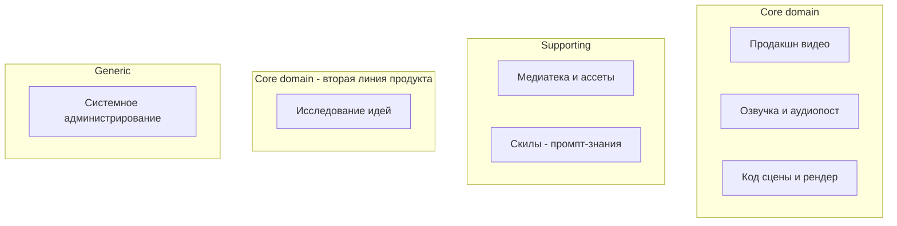

- **Core:** производство видео (сценарий → MP4), где голос (Voice), код+рендер (Motion) и оркестрация (Production) — три связанных ядра одной линии продукта.
- **Core (вторая линия):** исследование идей (Research) — самостоятельная функция продукта (DeepTrend), разделяет с первой линией только общие порты (LLM, HTTP).
- **Supporting:** медиатека (Media), скилы (Skills).
- **Generic:** системное администрирование хоста (System) — без бизнес-инвариантов.

### 3.2 Контекстная карта

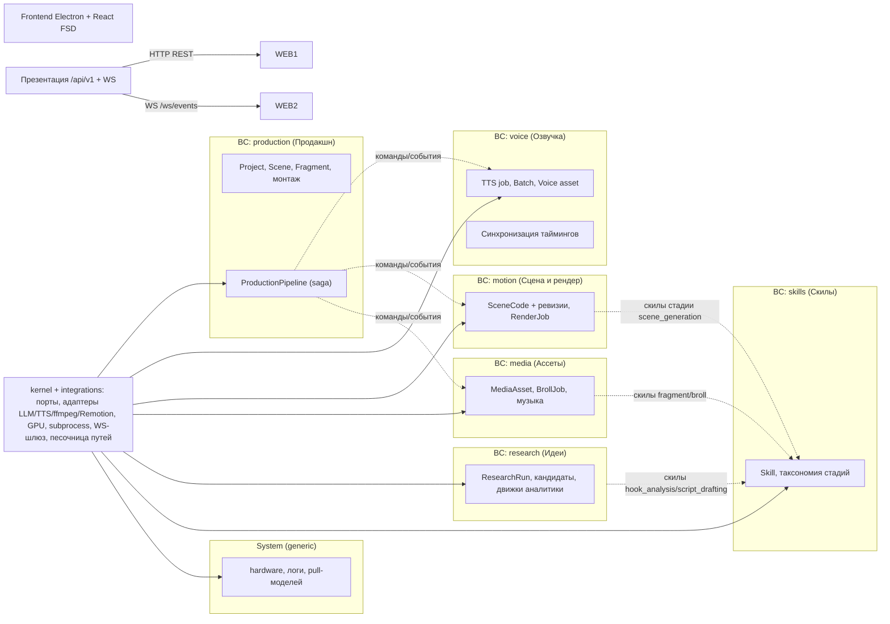

Потоки входа:
- **Прямые команды возможностей** (сегодняшний режим): фронт зовёт API Voice/Motion/Media/Research напрямую — быстрые точечные операции (озвучить фрагмент, отрендерить сцену, поискать идеи).
- **Оркестрация Production (цель):** для «полного авто-пайплайна» фронт отдаёт одну команду Production (`произвести сцену/проект`), а saga сама вызывает возможности и подписывается на их события.

### 3.3 Правила зависимостей (главное правило модульности)

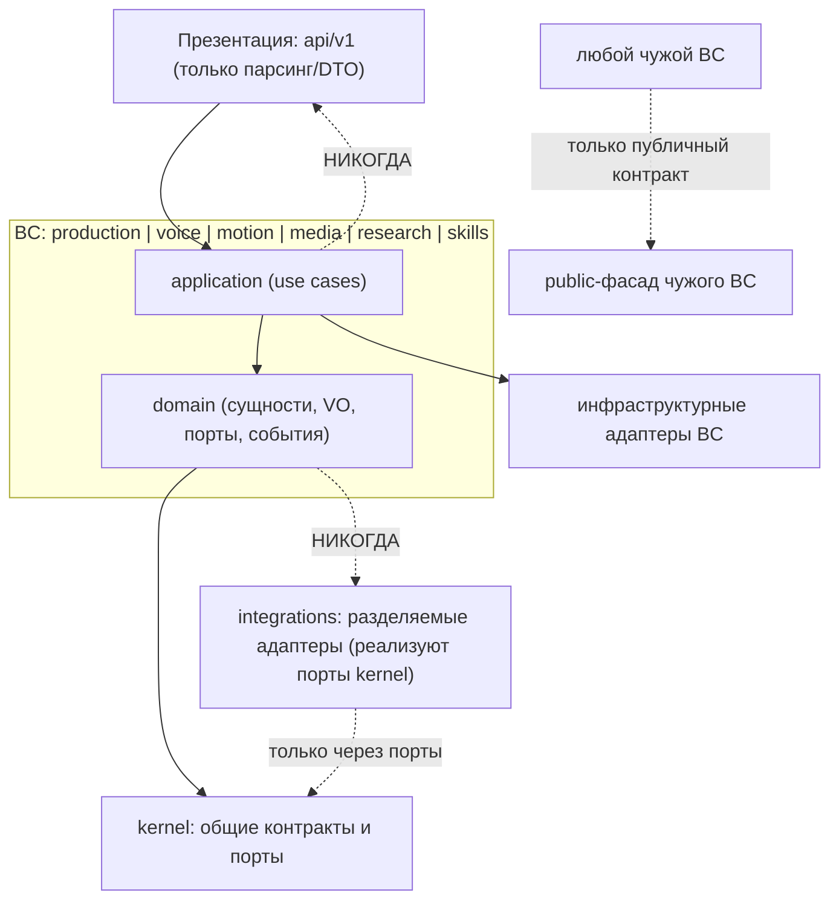

Правила (в порядке убывания строгости):

1. **Правило зависимости слоёв.** Внутри каждого BC: `domain` ничего не знает об `application`, инфраструктуре, API и фреймворках. `application` знает только `domain` + публичные контракты других BC. Инфраструктура реализует порты `domain`.
2. **Изоляция BC (DDD004).** Импорт *внутренностей* чужого BC запрещён. Внешнему миру BC открывает единственный публичный фасад (`contracts.py`), объявляющий команды, события и read-model.
3. **Ссылки на чужие агрегаты — только по ID (DDD006).** Сцена не хранит объект «голос», сцена хранит `voice_asset_id` / путь-ссылку.
4. **Один use case мутирует один агрегат (DDD007).** Несколько агрегатов обновляются через события/сагу, а не прямым вызовом.
5. **Cross-BC коммуникация** — только через in-process шину доменных событий или публичные контракты. Никаких общих мутабельных синглтонов-состояний между BC.
6. **События именуются в прошедшем времени (DDD010)**, VO неизменяемы и без ID (DDD009), доменные сервисы stateless (DDD013).

---

## 4. Текущее состояние → целевое (карта разрывов)

Что обнаружено в коде и как это закрывает целевая архитектура. **Помечаю уровень уверенности маркерами `[ФАКТ]` (проверено чтением кода) и `[ВЫВОД]`.**

### 4.1 Сильные стороны — сохраняем как есть

| Механизм | Где сейчас | Почему оставляем |
|---|---|---|
| Песочница файловых путей | `core/path_resolver.py`, `allowed_roots` в `core/config.py` | [ФАКТ] единственная точка контроля Path Traversal; в target → kernel/fs. |
| Супервизор subprocess | `core/process_supervisor.py` (Job Object, журнал сирот) | [ФАКТ] критичен на Windows; → kernel/platform. |
| GPU-арбитраж | `core/gpu.py` (lock-файл + asyncio + threading) | [ФАКТ] → kernel/platform. |
| WS-шлюз | `core/ws.py` (`ws_manager`) | [ФАКТ] → kernel/platform; остаётся каналом прогресса UI. |
| Доменные исключения + единый конверт ошибок | `domain/exceptions.py` + `api/error_handlers.py` | [ФАКТ] уже близко к DDD (ResourceNotFoundError → 404 и т.п.); → kernel/exceptions. |
| Репозиторий скилов | `infrastructure/skills/repository.py` + `SqliteSkillsRepository` | [ФАКТ] уже репозиторный паттерн; переносим целиком в BC Skills. |
| Слайс-иерархия исключений, seed-синхронизация | `infrastructure/db/bootstrap.py`, `skills_seed.json` | [ФАКТ] остаётся владением BC Skills. |

### 4.2 Разрывы и целевое решение

| # | Проблема (as-is) | Доказательство | Решение (to-be) |
|---|---|---|---|
| G1 | **Domain-слой пустой.** `domain/` = только Pydantic-DTO и исключения; все инварианты и поведение в `services/`. | [ФАКТ] `domain/schemas/*` — контракты, `services/*` ~2.3k LOC логики; `ddd_guard` ждёт `bc/domain` структур, которых нет. | Моделировать агрегаты/процессы с инвариантами в каждом BC; services разбить на use cases + доменные сервисы. |
| G2 | **Нет границ BC.** `infrastructure/youtube/*` (28 модулей) и `youtube_service` — моно-мир без публичного интерфейса; сервисы свободно импортируют чужие схемы. | [ФАКТ] `services/*` и `infrastructure/*` импортируют `domain/schemas/*` напрямую. | Каждый контекст получает `contracts.py`; доступ извне — только через него. |
| G3 | **Нет агрегата «Проект».** Проект — просто строка-путь; полный снапшот `ProjectData` пересылается в каждом запросе (codegen, render); оркестрация — на клиенте. | [ФАКТ] `ProjectData` в `domain/schemas/common.py`; эндпоинты принимают `project_path`. | BC Production: `Project` AR + манифест; saga «производство сцены/проекта»; read-model вместо пересылки снапшота. |
| G4 | **Двойное владение скилами.** CRUD существует дважды: `/api/v1/skills` (PATCH) и `/api/v1/system/skills` (PUT + reset + remotion-skills-sync). | [ФАКТ] `api/v1/skills.py` и `api/v1/system.py:84-126` бьют в одну таблицу. | Единственный владелец — BC Skills; один CRUD-интерфейс. |
| G5 | **Дубли/легаси-слои.** `app/schemas/*` — мёртвые прокси; `domain/schemas/system.py` содержит неиспользуемые легаси-модели; `core/exceptions.py` — мусорный мост; `infrastructure/storage/path_resolver.py` и `infrastructure/system/` — пустые реэкспорты; `utils/ffmpeg.py` не имеет потребителей. | [ФАКТ] `app/schemas/*` импортируется только тестами; `utils/ffmpeg.py` — ни одним модулем `app`. | Удалить при рефакторинге (фаза 5). |
| G6 | **Хрупкое cross-service состояние.** `render_service` импортирует синглтон `RenderTaskManager`; прогресс пишется в `ws_manager` из трёх мест; состояние задач — in-memory, переживает только разрыв WS. | [ФАКТ] `render_service.py:26`; `render_task_manager.py` (TTL 3600). | Задача-агрегат (`RenderJob`) в Motion с собственным store; прогресс — событие BC → WS-шлюз; персистентность состояния — манифест/журнал. |
| G7 | **Отсутствие доменных событий.** Факты («озвучка готова», «тайминги посчитаны», «рендер завершён») не публикуются; консьюмеры опрашивают или держат состояние. | [ВЫВОД] Нет ни одного `*Event`/шины; координация «в лоб» в сервисах и на клиенте. | In-process шина; BC публикуют факты, saga/UI подписываются. |
| G8 | **Смешение сфер в utils/audio_utils** (TTS-теги, длительности, маппинг загруженных файлов на сцены) и дубли ffmpeg-обёрток. | [ФАКТ] `utils/audio_utils.py` используют и TTS-провайдеры, и audio_service, и media. | Разложить по BC: парсинг голосовых тегов → Voice; длительности/ffprobe → kernel/integrations; маппинг файлов → Media/Voice. |
| G9 | **Репо-хранилища не разделены по владельцам.** Одна таблица `skills`; история кода — файлы в `data_storage/code_history`; логи/журнал — общие JSONL. Миграций нет. | [ФАКТ] единственная ORM-модель `SkillModel`; `create_all` на старте. | Владение хранилищами закрепляется за BC (см. §7). Alembic подключается, когда таблиц станет >2. |

### 4.3 Как читать целевые диаграммы

Ниже — **целевая** модель. Сущности, которых сегодня нет физически (например, `VoiceAsset`, `RenderJob`, манифест проекта), помечены. Названия-сущности даны на английском (идентичны будущим именам классов), описания — на русском.

---

## 5. Модульные границы целевой архитектуры

### 5.1 Физическая структура (цель)

```
backend/app/
├── main.py                    # композиционный корень: только wiring (без логики)
├── kernel/                    # Общее ядро — разрешено всем BC
│   ├── contracts/             #   общие read-model и DTO-мостики (см. §6.1)
│   ├── ports/                 #   интерфейсы: llm, asr, embeddings, tts, ffmpeg, remotion, pexels, inner-tube, skills-catalog, workspace-fs, process, gpu, ws, clock
│   ├── events.py              #   конверт доменного события + in-process шина (порт)
│   ├── exceptions.py          #   VidoraException и наследники (перенос из domain/exceptions)
│   └── platform/              #   core/* сейчас: process_supervisor, gpu, logging, path_resolver(песочница), ws, config
├── production/                # BC: Продакшн (core)
│   ├── domain/                #   Project, Scene, SceneFragment, MontageSettings, Timings, pipeline-стадии; порты
│   ├── application/           #   use cases + ProductionPipeline (saga)
│   ├── infrastructure/        #   scenario-парсер, манифест-репозиторий, экспорт/конкатенация
│   └── contracts.py           #   публичный фасад
├── voice/                     # BC: Озвучка и аудиопост (core)
│   ├── domain/                #   TTS job, BatchJob, VoiceAsset, голосовые теги; события; порты tts/asr/enhance
│   ├── application/           #   use cases генерации/батча/синхронизации/фильтров
│   ├── infrastructure/        #   провайдеры TTS, worker-процессы, alignment/whisper, enhancer, ducking
│   └── contracts.py
├── motion/                    # BC: Код сцены и рендер (core)
│   ├── domain/                #   SceneCode, SceneRevision, RenderJob; события; порты llm/remotion/ffmpeg
│   ├── application/           #   use cases кодогенерации и рендера
│   ├── infrastructure/        #   CodeHistoryRepo, RemotionRunner, tsx-извлечение/санитизация
│   └── contracts.py
├── media/                     # BC: Ассеты и медиатека (supporting)
│   ├── domain/                #   MediaAsset, BrollJob, музыка, библиотека
│   ├── application/           #   загрузка, normalize, сток (Pexels), auto-broll, библиотеки
│   ├── infrastructure/        #   ffmpeg-нормализация, pexels-клиент
│   └── contracts.py
├── research/                  # BC: Исследование идей (core, 2-я линия)
│   ├── domain/                #   ResearchRun, Candidate, Signal, Opportunity, отчёты; движки (чистые доменные сервисы)
│   ├── application/           #   use cases: DAG-поток, hook, script, конкуренты, канал, thumbnail
│   ├── infrastructure/        #   ingestor'ы, inner-tube, searcher, whisper, экспорт xlsx, кэши
│   └── contracts.py
├── skills/                    # BC: Скилы (supporting)
│   ├── domain/                #   Skill, SkillStage, SkillCreate/Update, prompt_builder (переезд из domain/skills)
│   ├── application/           #   CRUD-скилов (единственный), reset/seed-sync, выборка для стадии
│   ├── infrastructure/        #   SqliteSkillsRepository, seed, bootstrap
│   └── contracts.py
├── system/                    # Generic: хост-администрирование
│   └── application/           #   hardware, логи, pull-моделей (тонкие use cases)
└── api/                       # ПРЕЗЕНТАЦИЯ (единственный владелец FastAPI/WS)
    ├── deps.py                #   DI-композиция: порты → адаптеры
    ├── error_handlers.py
    └── v1/                    #   тонкие роутеры: DTO → вызов use case
```

> [ВЫВОД] Пакеты BC — плоские (`production/`, а не `app/bc/production/`): корень `app` уже является границей «приложения», лишняя вложенность не добавляет изоляции.

### 5.2 Таблица переноса существующих путей

| Сейчас | Куда (target) |
|---|---|
| `app/core/*` (кроме `database`, `config`) | `app/kernel/platform/` |
| `app/core/database.py` (engine/session) | технический адаптер в `kernel/` (используется только Skills и композицией) |
| `app/core/config.py` | `app/kernel/platform/config.py` |
| `app/core/path_resolver.py` | `app/kernel/fs/` (остаётся каноном песочницы) |
| `app/domain/exceptions.py` | `app/kernel/exceptions.py` |
| `app/domain/skills/*` | `app/skills/domain/` |
| `app/domain/schemas/common.py` (Scene/Project/…), `render.py` | split: read-model проекта → `production/contracts.py`; снапшот-мостик → `kernel/contracts/` пока фронт не мигрировал |
| `app/domain/schemas/audio.py` | `app/voice/domain/` |
| `app/domain/schemas/code.py`, `render.py` (RenderRequest) | `app/motion/domain/` |
| `app/domain/schemas/media.py` | `app/media/domain/` |
| `app/domain/schemas/youtube.py` | `app/research/domain/` |
| `app/domain/schemas/system.py` | `app/system/` (легаси-модели удалить, G5) |
| `app/schemas/*` (прокси) | удалить (G5) |
| `app/services/audio_service.py` | `app/voice/application/` |
| `app/services/code_gen_service.py` | `app/motion/application/` |
| `app/services/render_service.py` + `render_task_manager.py` | `app/motion/application/` (store → `motion/infrastructure/RenderJobStore`) |
| `app/services/media_service.py` | `app/media/application/` |
| `app/services/youtube_service.py` | `app/research/application/` |
| `app/services/system_service.py` | `app/system/application/` |
| `app/infrastructure/ai/llm/*` | `integrations/llm` (адаптер порта kernel; `tsx_parser` → `motion/infrastructure`) |
| `app/infrastructure/ai/tts/*` + `app/infrastructure/workers/*` | `app/voice/infrastructure/` |
| `app/infrastructure/ai/audio_tools/*` | `app/voice/infrastructure/` |
| `app/infrastructure/media/ffmpeg.py` | `integrations/ffmpeg` (разделяемый адаптер); `ducking.py` → `voice/infrastructure/` |
| `app/infrastructure/remotion/*` | `app/motion/infrastructure/` |
| `app/infrastructure/skills/repository.py` + `db/models.py` + `db/bootstrap.py` | `app/skills/infrastructure/` |
| `app/infrastructure/storage/code_history_repo.py` | `app/motion/infrastructure/` |
| `app/infrastructure/storage/path_resolver.py` (реэкспорт) | удалить (G5) |
| `app/infrastructure/system/` (пустой) | удалить |
| `app/infrastructure/youtube/*` | `app/research/infrastructure/` |
| `app/utils/audio_utils.py` | разложить: Voice/Media (G8); `app/utils/ffmpeg.py` → удалить (G5) |
| `backend/cli.py` + `app/cli/commands.py` (yt-*) | вход в BC Research (тот же use case) |

---

## 6. Тактический дизайн по контекстам

Формат каждого BC: **назначение → язык → агрегаты и модель → границы (ответственность / НЕ-ответственность) → публичный контракт → порты и адаптеры → владение данными → события наружу.**

### 6.1 kernel (общее ядро)

**Состав (минимальный, без бизнес-логики):**
- `ports` — интерфейсы, которые объявляет система и реализуют адаптеры из `integrations`/BC: LLM (текст/JSON), эмбеддинги, распознавание речи (asr), синтез речи (tts), ffmpeg-процессинг, запуск Remotion, Pexels, InnerTube/ytscrape/Reddit-HTTP, каталог скилов, файловая песочница, запуск/остановка процессов, выделение GPU, шина событий, WS-рассылка, часы.
- `events.py` — конверт события `{id, type, aggregate_id, occurred_at, payload}` + in-process шина (просто список подписчиков; без внешних брокеров).
- `exceptions.py` — каноническая иерархия (перенос).
- `platform/` — существующие `core/*`: `process_supervisor`, `gpu`, `logging`, `path_resolver`, `ws`, `config`.
- `contracts/` — общие read-model/DTO-мостики на период миграции фронта.

**Правило:** kernel не содержит бизнес-инвариантов; кто угодно может импортировать kernel, но kernel никого не импортирует из приложения.

### 6.2 BC production — «Продакшн» (core)

**Назначение.** Сценарий Markdown → структурированный проект → собранное видео. Владеет сценарной моделью и оркестрирует полный производственный цикл. Сегодня его роль исполняют клиент + «голые» вызовы сервисов — целевой контекст переносит эту координацию на сервер.

**Язык:** проект, сцена, фрагмент, реплика, монтажные настройки, тайминги, стадия производства, финальная сборка.

**Модель:**

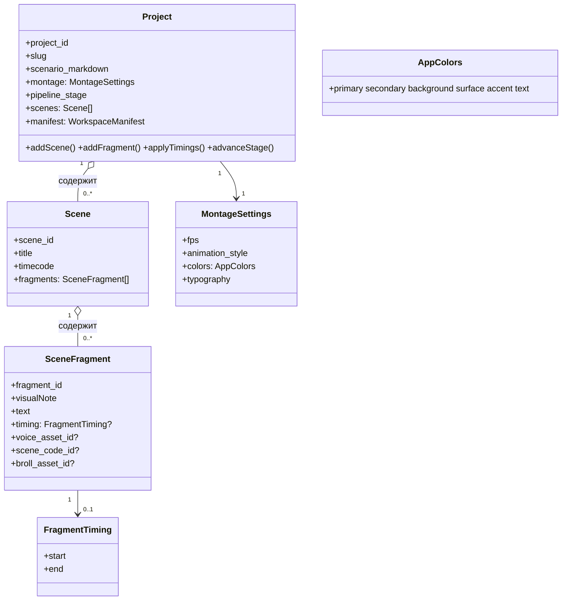

**Инварианты агрегата `Project`:**
- Порядок фрагментов в сцене и порядок сцен в проекте — атрибут агрегата (монтируемый порядок).
- Тайминги фрагментов монотонны и не выходят за длительность аудиодорожки сцены.
- `voice_asset_id`/`scene_code_id`/`broll_asset_id` — ссылки по ID на агрегаты чужих BC, никогда не объекты.
- Переход между стадиями — через конечный автомат `draft → voiced → timed → coded → rendered → cut` (состояния пишутся в манифест).

**Ответственность:** парсинг `SCENARIO.md`; манифест рабочей директории; снапшот проекта для UI и для движков (read-model); saga производства; финальная склейка видео и ZIP-экспорт; реестр проектов.
**НЕ-ответственность:** синтез голоса, расчёт слов/таймингов, генерация TSX, сам рендер, нормализация B-roll, поиск стоков, CRUD-скилов.

**Публичный контракт (примеры команд/событий, не эндпоинты):**
- команды: `CreateProject`, `UpdateScenario`, `ProduceScene(project_id, scene_id)`, `ProduceProject`, `ExportProject`, `ConcatFinalCut`.
- события наружу: `SceneTimingsUpdated`, `ProjectStageAdvanced`, `FinalCutReady`.
- read-model: `ProjectSnapshot` (то, что сегодня фронт собирает сам из `ProjectData`).

**Порты:** voice (публичный), motion (публичный), media (публичный), workspace-fs, events.
**Владение данными:** `<projects>/<slug>/` (сценарий, манифест), `<preview>/` и итоговый `mp4`.

### 6.3 BC voice — «Озвучка и аудиопост» (core)

**Назначение.** Текст → голосовой ассет; слова из аудио; постобработка (нормализация, денойз, удаление тишины, enhancer) и дакинг. Вся «физика звука», включая выгрузку моделей из VRAM.

**Язык:** озвучка, движок TTS, голос, дизайн-голоса, клон, референс, слова-таймкоды, фильтр, мастер-цепочка, дакинг.

**Модель:**

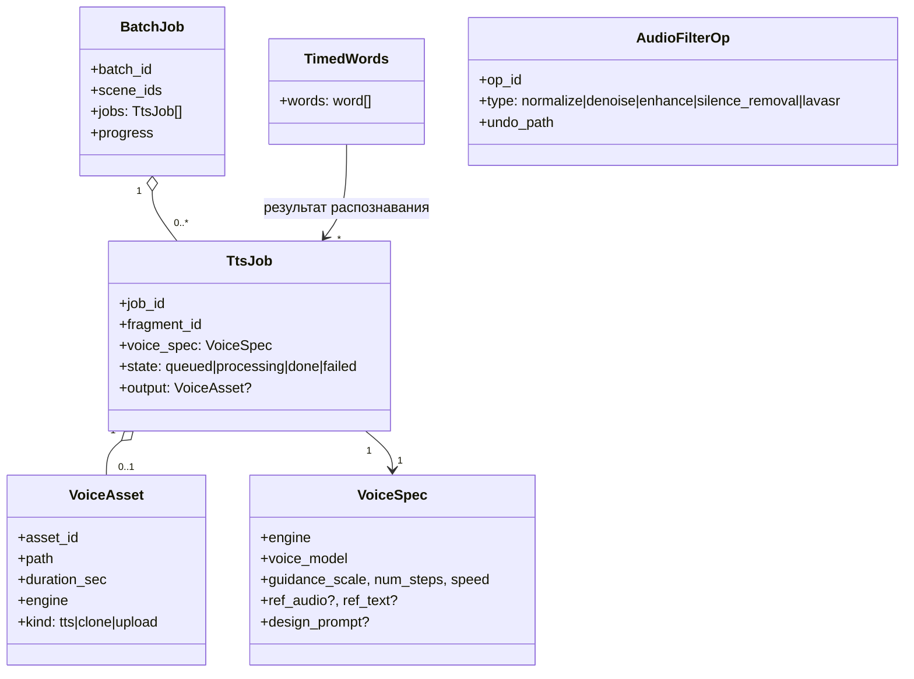

**Инварианты:**
- Смена активного провайдера TTS в процессе = выгрузка старого из VRAM (существующее поведение `TTSProviderFactory`) — обязанность use case, не домена.
- Один экземпляр тяжёлой GPU-модели на процесс — через порт `gpu`.
- Фильтр всегда оставляет `.bak` до успешного применения (гарантия undo, без потери данных — не упрощаем).
- Событие синхронизации уходит с типом таймингов + fallback-флагом (`fallback=true` когда Whisper не дал слов), чтобы Production не принимал эвристику за факт.

**Ответственность:** синтез и клонирование голоса (все движки); пакетная озвучка; forced-alignment (слова); аудиофильтры + undo; удаление тишины (VAD/пороги); дакинг и микширование голоса с музыкой; транскрипция.
**НЕ-ответственность:** тайминги фрагментов как атрибут сцен (применяет Production), выбор B-roll, рендер.

**Публичный контракт:** `GenerateTts`, `GenerateBatch`, `AlignScene`, `ApplyFilter`, `UndoFilter`, `PreviewDucking`, `Transcribe`, `UploadVoiceRef`.
События наружу: `VoiceGenerated`, `BatchVoiceDone(scene_id, timings)`, `AlignmentProduced`, `AudioFilterApplied`.

**Порты:** tts (синтез), asr (распознавание), ffmpeg, gpu, workspace-fs, events.
**Адаптеры (здесь же):** `TTSProviderFactory` + провайдеры (OmniVoice, Silero, CosyVoice, Fish-S2, Qwen/MOSS-воркеры, облачные), `WhisperModelCache`, `LavaSREnhancer`, whisper-воркеры, `ducking`.
**Владение данными:** `<project>/assets/voice/**`, `*.bak`, справочники моделей в `ai-models/`.

### 6.4 BC motion — «Код сцены и рендер» (core)

**Назначение.** Из сцены + проекта — Remotion TSX и его ревизии; из TSX — MP4-артефакт сцены.

**Язык:** код сцены, ревизия, рендер-задача, композиция, артефакт, предпросмотр.

**Модель:**

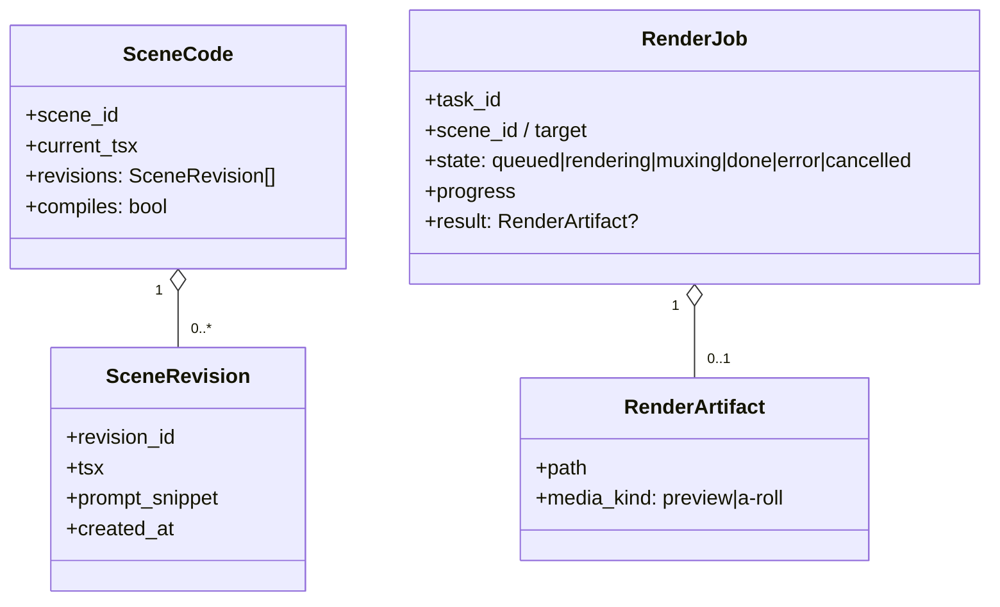

**Инварианты:**
- Код перед рендером изолируется и санитизируется (namespace-инг, плейсхолдеры под отсутствующие ассеты) — обязанность Motion, а не клиента.
- Ревизии неизменяемы (append-only) — история для откатов и CodeHistory UI.
- Рендер одного задания не должен читать/мутировать состояние другого (сегодня `RenderTaskManager` — класс-синглтон; целевой `RenderJobStore` — обычный инстанс, внедряемый в use case, либо явно документированный синглтон BC, не общий на приложение).
- Прогресс — это наблюдение за задачей (событие), а не состояние домена.

**Ответственность:** сборка промпта для генерации кода сцены (со скилами стадии `scene_generation`); вызов LLM; извлечение/валидация TSX; сохранение ревизий и файлов `<project>/code/a-roll/`; запуск/мониторинг/отмена рендера; mux аудио+видео; сохранение артефакта в `preview/` или `assets/a-roll/`; очистка временных артефактов.
**НЕ-ответственность:** структура проекта/сцен, выбор голоса, финальная склейка и ZIP-экспорт (Production), нормализация B-roll (Media), CRUD-скилов.

**Публичный контракт:** `GenerateSceneCode`, `SaveManualRevision`, `StartRender`, `CancelRender`, `GetRenderStatus`, `GetRevision`, `ListRevisions`.
События наружу: `SceneCodeGenerated`, `RenderFinished(artifact_ref)`, `RenderFailed`.

**Порты:** llm, ffmpeg, remotion-runner, gpu (clean_memory), workspace-fs, skills-catalog, events.
**Адаптеры (здесь же):** `RemotionRunner`, `CodeHistoryRepository` (файловый, из `infrastructure/storage`), tsx-парсер/санитизатор.
**Владение данными:** `<project>/code/a-roll/*.tsx`, `data_storage/code_history/**`, превью-артефакты, временные `src/jobs/{task_id}`/`public/jobs/{task_id}` (жизненный цикл задания).

### 6.5 BC media — «Ассеты и медиатека» (supporting)

**Назначение.** Единый вход «сырых» аудиовизуальных файлов в проект: загрузки, сток (Pexels), B-roll (подбор, нормализация, автоподбор по фрагментам), музыкальная библиотека. Media отвечает за **формат**, а не за семантику голоса/сцены.

**Язык:** ассет, B-roll, сток, нормализация, формат (16:9/9:16), библиотека музыки, категория, трек.

**Модель:**

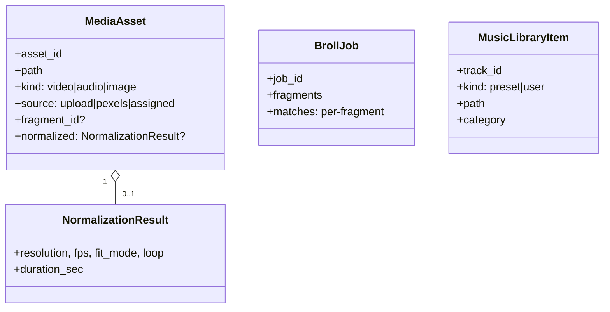

**Инварианты:** выход проекта запрещён (песочница путей, существующий `SecurityPathViolation`); нормализация никогда не пишет поверх исходника; не-видео сток помечается `matched=false + reason` (не молча пропускается).

**Ответственность:** загрузка файлов; нормализация B-roll (fit: cover/blur_pad, fps, loop); поиск/скачивание стоков Pexels; автоподбор B-roll по фрагментам (через LLM-порт); сканирование музыкальной библиотеки; отдача медиа из песочницы.
**НЕ-ответственность:** выбор голоса, озвучка, рендер, сборка, тайминги.

**Публичный контракт:** `UploadMedia`, `NormalizeBroll`, `AutoBroll`, `SearchStock`, `DownloadStock`, `MusicLibrary`.
События наружу: `BrollPrepared(fragment_id)`, `StockDownloaded`.

**Порты:** llm (для автоподбора запросов), pexels, ffmpeg, workspace-fs.
**Адаптеры:** ffmpeg-нормализация, pexels-клиент.
**Владение данными:** `<project>/assets/b-roll/**`, `<project>/assets/music/**`, каталог стоков в песочнице.

### 6.6 BC research — «Исследование идей» (core, 2-я линия)

**Назначение.** Поиск и аналитика YouTube-идей (DeepTrend): ранние сигналы, кандидаты-«ракеты», голубые океаны, золотые жилы комментариев, хуки, черновики сценариев. Самодостаточный контекст; делит с первой линией только kernel-порты (LLM/эмбеддинги/HTTP/процессы) и скилы.

**Язык:** тема, запрос, ранний сигнал, кластер сигналов, кандидат-видео, M-score, стадия разгона, VPS, голубой океан, арбитраж, confusion-индекс, золотая жила комментариев, пакет идей.

**Модель (агрегат процесса + вычисляемые VO):**

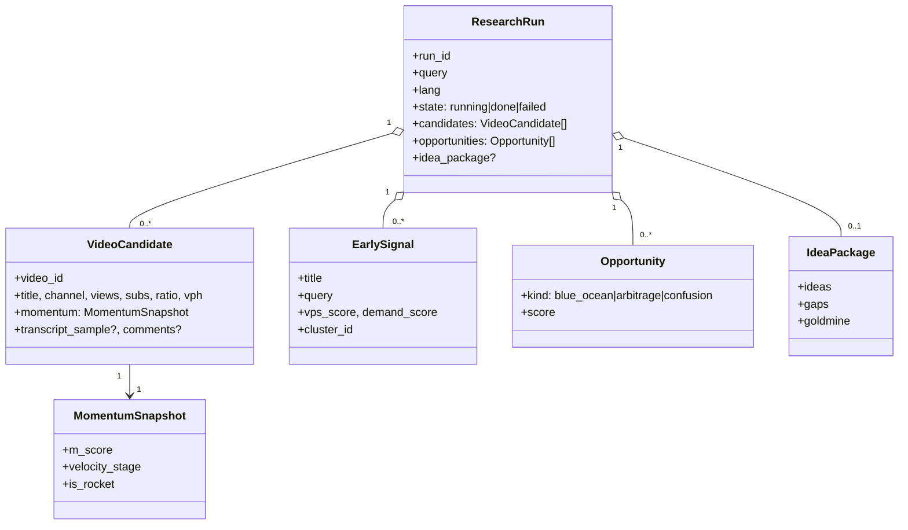

**Ключевые доменные сервисы (stateless, вычисления):** MomentumEngine (M-score/стадии), BlueOceanDetector (матрица спрос×контент), TrendArbitrageEngine, ConfusionDetector, CommentGoldmineExtractor (эвристический fallback обязателен), DenseClusterizer, ThumbnailVision. DAG-конвейер — **application**-слой: три параллельных воркера + очередь событий = потоковая выдача NDJSON. Кэши и circuit breaker — infrastructure (не домен).

**Ответственность:** полный DAG-поток идей; анализ хука; драфт сценария; поиск конкурентов; анализ канала; метаданные/транскрибация; концепт обложки; экспорт в Excel.
**НЕ-ответственность:** производство видео, озвучка, рендер, скилы CRUD.

**Публичный контракт:** `StreamIdeaRun`, `AnalyzeHook`, `DraftScript`, `SuggestCompetitors`, `AnalyzeChannel`, `Comments`, `MoreVideos`, `DownloadMetadata`, `ThumbnailPrompt`.
События наружу: потоки `stream` — это протокол сессии UI (NDJSON), **не** доменные события между BC. Research не публикует факты, нужные другим BC.

**Порты:** llm, embeddings, inner-tube/ytscrape/reddit http-пул, whisper, excel-экспорт, skills-catalog, process, cache-порт.
**Владение данными:** экспорт `assets/data/*.xlsx` в рабочем каталоге запроса; внутренние кэши — в памяти процесса (не персист).

### 6.7 BC skills — «Скилы» (supporting)

**Назначение.** Единственный владелец таксономии промпт-пакетов: канонические (seed) и кастомные скилы, стадии, бюджет промпта. Потребители — Motion (кодогенерация), Research (хуки/сценарии), Voice (голосовые правила) — получают **готовый блок текста** через порт `skills-catalog`, никогда не читая таблицу напрямую.

**Модель:**

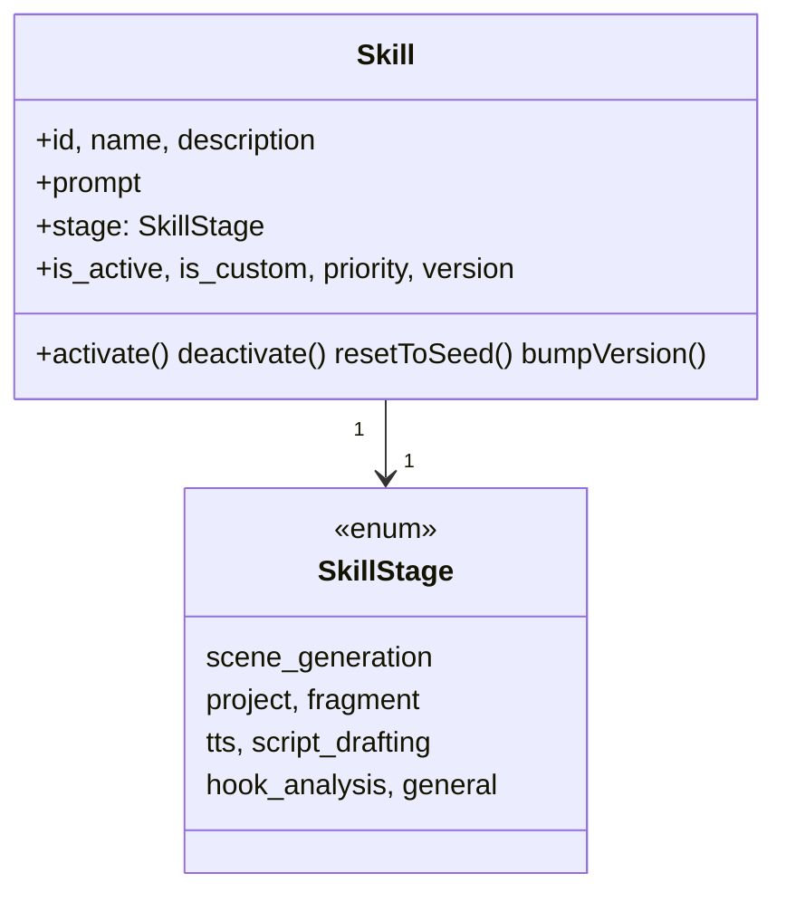

**Инварианты:** `stage` валиден и для кастомных скилов приводится к `general`; канонические скилы не редактируются как кастомные (reset к seed); стадия запроса всегда включает `general`; сборка блока — до лимита символов с сортировкой `priority`.

**Публичный контракт:** `ListSkills`, `GetSkill`, `CreateSkill`, `UpdateSkill`, `DeleteSkill`, `ResetSkill`, `SyncFromSeed`, `SkillBundleForStage(stage)`.
События наружу: `SkillChanged` (инвалидация кэш-блоков у консьюмеров — опционально, пока сборка идёт на каждый запрос).

**Порты:** skills-storage (репозиторий), seed-источник.
**Адаптеры:** `SqliteSkillsRepository`, `bootstrap` (seed-синхронизация на старте), таблица `skills` — единственная таблица приложения на старте миграции.
**Владение данными:** таблица `skills` в `data_storage/app.db`; `data/seeds/skills_seed.json` (read-only артефакт).

> Устранение G4: CRUD живёт только здесь. `/api/v1/system/skills*` и `/api/v1/skills*` схлопываются в один фасад.

### 6.8 BC system (generic)

Хост-администрирование, **без доменных инвариантов**: информация о железе (psutil/torch), просмотр логов, pull моделей (ollama/hf/silero через супервизор). Остаётся тонким application-слоем поверх kernel/platform. `CodeHistory` и скил-операции отсюда **уходят** в Motion и Skills (это устраняет сегодняшний «мусорный» системный сервис). Может остаться модулем `app/system` без строгой BC-обвязки.

---

## 7. Владение данными

### 7.1 Матрица владения

| Данные | Владелец (BC) | Хранилище | Адаптер доступа |
|---|---|---|---|
| Скилы | Skills | SQLite `skills` | `SqliteSkillsRepository` |
| Сценарий/структура проекта, манифест, стадии | Production | `<projects>/<slug>/` + `manifest.json` | scenario-парсер, manifest-repo |
| Код сцен и ревизии | Motion | `data_storage/code_history/**` + `<project>/code/a-roll/` | `CodeHistoryRepository` |
| Рендер-артефакты, превью | Motion | `<project>/preview/`, `assets/a-roll/` | workspace-fs |
| Голосовые ассеты и `.bak` | Voice | `<project>/assets/voice/**` | workspace-fs |
| B-roll, музыка, сток | Media | `<project>/assets/b-roll/**`, `assets/music/**` | workspace-fs |
| Модели/веса, VRAM | kernel/platform (не BC) | `ai-models/`, `CACHE_DIR` | gpu/platform |
| Логи приложения | kernel/platform | `data_storage/app_events.jsonl` | logging |
| Экспорт Excel идей | Research | `<project>/assets/data/*.xlsx` | exporter |

### 7.2 Правила хранения

1. **Один BC = один владелец зоны данных.** Никто, кроме владельца, не пишет в каталог/таблицу. Чтение чужих данных — только через публичный контракт или read-model.
2. **Агрегат не «течёт» в файл напрямую.** Агрегат изменяется в памяти, затем use case сохраняет его через порт-репозиторий владельца (манифест проекта, журнал заданий). Сырые «кидания файлов по пути» из сервисов прекращаются: файловый доступ — через `workspace-fs` порт, который знает песочницу.
3. **Состояние долгих задач персистится лёгко** (манифест/JSON-журнал рядом с артефактом), а не только в памяти — чтобы переживать перезапуск процесса (как уже делает `ProcessSupervisor` для subprocess).
4. **SQLite остаётся**; alembic добавляется, когда таблиц станет больше двух. До этого — аккуратный `create_all` + seed у владельца (Skills).

---

## 8. Ключевые взаимодействия

### 8.1 Полный производственный цикл сцены (целевая saga)

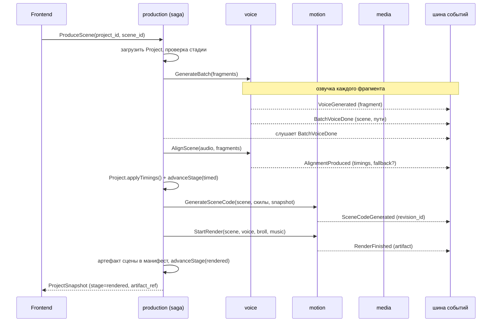

### 8.2 Точечная озвучка фрагмента (сегодняшний путь остаётся)

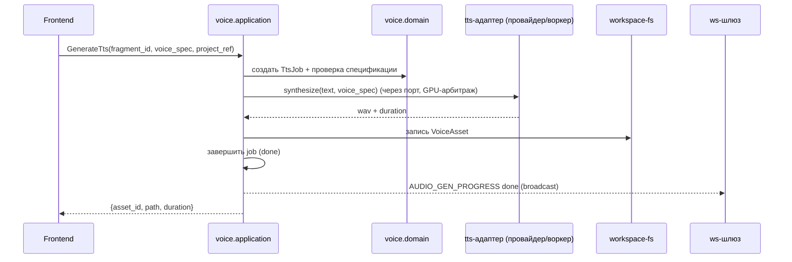

### 8.3 Рендер сцены (motion)

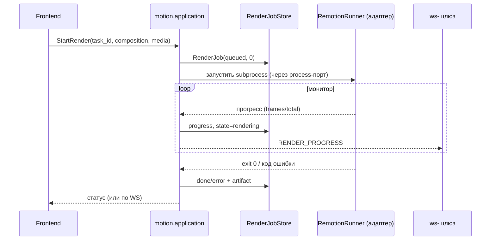

### 8.4 Исследование идей (research, потоковый DAG)

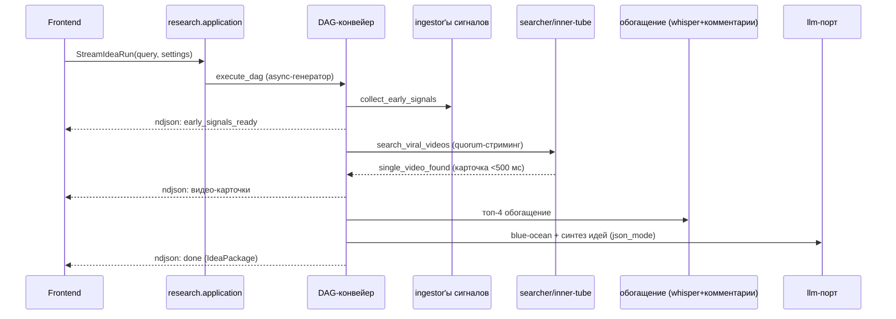

### 8.5 Правила коммуникации между BC

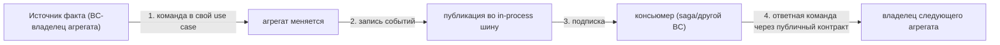

- **Прямые вызовы между BC** — только «публичный контракт контекста» (фасад), и только application→application (никаких domain-объектов на экспорт).
- **Данные между BC** — read-model/команды с ID, никогда не объекты агрегатов (DDD006).
- **Прогресс/состояние долгих операций** — наблюдение (событие-прогресс на задачу) → WS-шлюз; доменная шина несёт только бизнес-факты.
- **ACL к внешнему миру** — LLM-шлюзы, InnerTube, Reddit, Pexels, Remotion, ffmpeg — реализуются адаптерами, переводящими «их» протоколы в порты kernel. Ни один BC не знает URL облаков, форматов провайдеров и т.п.

---

## 9. Сквозные механизмы

| Сквозная функция | Решение | Комментарий |
|---|---|---|
| **LLM** | Один адаптер `integrations/llm` реализует порт kernel `llm` (текст/JSON). Снаружи — движки/облака (gateway, grammar, speculative) | [ФАКТ] уже единый `LLMGateway`; остаётся единым, переезжает в integrations. `tsx_parser` — инструмент Motion. |
| **TTS / воркеры** | Провайдеры + factory — внутри Voice. subprocess-воркеры (Qwen/MOSS/CosyVoice) живут в Voice и управляются `process`-портом | [ФАКТ] воркеры уже спавнятся провайдерами; сохраняем, меняем только владельца каталога. |
| **GPU** | `gpu`-порт: три контура блокировки. Единственный арбитр VRAM-моделей и чисток перед Chromium | Сохранить как есть. |
| **Subprocess** | `process`-порт поверх `ProcessSupervisor`: Job Object, журнал сирот, двухфазный stop | Сохранить как есть. |
| **WS-шлюз прогресса** | `ws`-порт: `AUDIO_GEN_PROGRESS`, `BATCH_AUDIO_PROGRESS`, `RENDER_PROGRESS`. Производственные контексты публикуют наблюдения; шлюз рассылает | [ФАКТ] форматы уже согласованы с фронтом — не менять. |
| **Потоковые ответы** | NDJSON `StreamingResponse` — только для Research сессий (не WS) | Сохранить как есть. |
| **Ошибки** | `kernel/exceptions` + единый конверт `{status,error_code,detail,details}`; `api/error_handlers` — единственный регистратор | Сохранить. |
| **Файловая песочница** | `fs`-порт: `is_safe_path` по `allowed_roots`, санитизация имён | Сохранить. |
| **Качество/инварианты** | non-trivial логика каждого BC — один runnable self-check/тест на границу (без новых фреймворков) | Продолжаем политику репозитория. |

---

## 10. Стратегия перехода (без big-bang)

Целевая структура достигается **пошаговым переносом**, не одномоментным рефакторингом: каждый шаг оставляет систему зелёной.

### Фаза 0 — зафиксировать и измерять
- Прогнать `ddd_guard.py` по `backend/app` в текущем виде — зафиксировать стартовый счёт нарушений.
- Дополнить его правилом **изоляции BC по факту наличия `contracts.py`** (сейчас правила настроены на структуру `bc/domain/…`, которой нет).
- Ввести контрактные тесты границ: «скилы меняются только через Skills», «история кода — только через Motion» и т.д. (по одному тесту на границу).

### Фаза 1 — дешёвые победы (удаление дублей, без движения кода)
- Удалить `app/schemas/*` (прокси) и перевести оставшиеся импорты на `domain.schemas`.
- Удалить легаси-модели скилов из `domain/schemas/system.py` (G5).
- Схлопнуть двойной CRUD скилов: оставить один фасад (рекомендация — `/api/v1/skills`), второй помечать deprecated (G4).
- Удалить `utils/ffmpeg.py`, `infrastructure/storage/path_resolver.py`, пустой `infrastructure/system/`, `core/exceptions.py` (мост).

### Фаза 2 — ввести границы BC без смены путей (минимальная)
- Ввести публичные фасады-контракты по контекстам **поверх существующих сервисов**: `contracts.py` для voice/motion/media/research/skills, экспортирующие use case-методы. Сервисы перестают импортироваться напрямую извне.
- Ввести in-process шину событий; `AudioService`/`RenderService` начинают публиковать `VoiceGenerated`/`RenderFinished` (события-факты), не меняя WS-рассылку.

### Фаза 3 — моделировать Проект и задачи-агрегаты
- BC Production: `Project` AR + парсер `SCENARIO.md` + манифест. Начать с read-model: фронт продолжает слать `project_path`, но сервер параллельно ведёт манифест.
- Задачи: `TtsJob`, `RenderJob` как агрегаты процесса с store-интерфейсом (заменить класс-синглтон `RenderTaskManager` на инстанс с явным жизненным циклом).
- Saga `ProduceScene`: первая вертикаль «кнопка → полный цикл сцены» как опция рядом с точечными вызовами.

### Фаза 4 — физический перенос модулей
- Перенос по таблице §5.2 мелкими пачками: voice (tts+audio_tools+workers+audio_service), motion (remotion+code_history+render_service), media, research (28 модулей youtube), skills (repo+db+bootstrap+prompt_builder). Каждая пачка — отдельный коммит с зелёным тестами.
- `core/*` → `kernel/platform/*`; `domain/*` → kernel/BC; исключения → `kernel/exceptions`.
- CLI yt-команды переводятся на use case Research.

### Фаза 5 — чистка и усиление контроля
- Удалить снапшот-мостики в `kernel/contracts`, когда фронт мигрирует на read-model (проект по ID, без пересылки `ProjectData` в каждый запрос).
- Подключить `ddd_guard` в CI-скрипт сборки; контрактные тесты границ в `tests/`; удалить устаревшие тесты-заглушки (напр. `test_architecture_srp`, который SRP не проверяет).
- Alembic — когда появится вторая таблица владельца.

### Намеренно НЕ делаем (YAGNI)
- Микросервисы, отдельные БД/брокеры на BC — не нужны, продукт локальный десктоп.
- CQRS/Event-sourcing, outbox, сага-фреймворки — хватает in-process шины и явного кода саги.
- Репозиторий под каждый файл — только там, где есть инварианты (манифест, журнал задач).
- Идемпотентные потребители/повторы — не требуются, пока шина in-process и потребители переживают сбой вместе с процессом.
- **Инфраструктура `core` (супервизор, GPU, WS, песочница, logging) не «домайн-моделируется»** — это платформа, переносим её в `kernel/platform` без изменений поведения.

---

## 11. Критерии приёмки целевой архитектуры

1. `ddd_guard` проходит по `backend/app` (нулевой счёт нарушений) и включён в CI.
2. `services/*` не существует как слой: остались только `application` внутри BC и `kernel`.
3. Ни один модуль не импортирует внутренности чужого BC (проверяется тестом границ).
4. Ровно один CRUD-скилов; ровно один владелец каждого каталога проекта и каждой таблицы.
5. Полный цикл «озвучить→синхронизировать→сгенерировать→отрендерить» доступен одной командой `ProduceScene` и точечными вызовами — без потери нынешнего поведения API для фронта.
6. Доменные события: `VoiceGenerated`, `BatchVoiceDone`, `AlignmentProduced`, `SceneCodeGenerated`, `RenderFinished`, `SceneTimingsUpdated`, `FinalCutReady` публикуются и имеют подписчиков; прогресс продолжает уходить в WS теми же форматами, что фронт уже понимает.
7. Агрегат `Project` (манифест + стадии) переживает рестарт процесса; статусы рендер/озвучка восстанавливаются или честно помечаются как прерванные.
